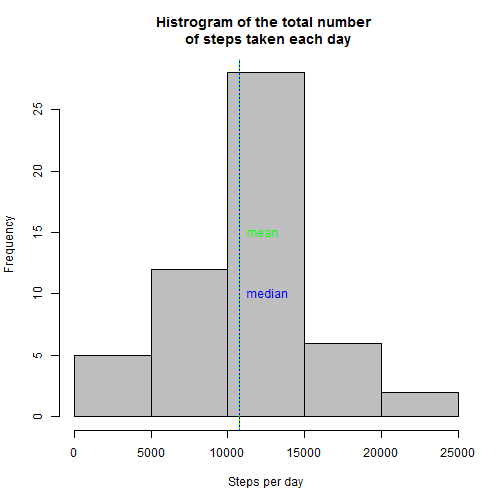
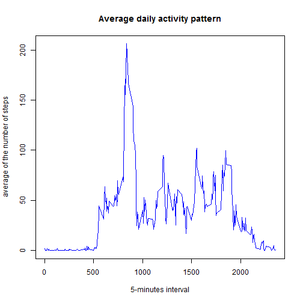
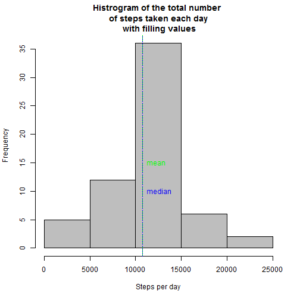
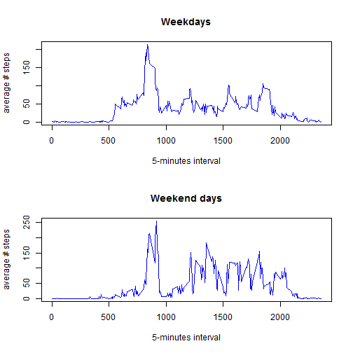

## Loading and preprocessing the data
Download the data activity.csv in your working directory.
Read the data in R:

```r
data<-read.csv("activity.csv")
complete<-subset(data,complete.cases(data)==TRUE)
```


## What is mean total number of steps taken per day?

Calculate the total number of steps taken per day

```r
stepsPerDay<-aggregate(steps~date,complete,sum)
```
histogram of the total number of steps taken each day

```r
library(ggplot2)
hist(stepsPerDay$steps,main="Histrogram of the total number \n of steps taken each day",xlab="Steps per day",col="gray")
abline(v=mean(stepsPerDay$steps),col="green",lty=5)
text(mean(stepsPerDay$steps),15,labels="mean",col="green",pos=4)
abline(v=median(stepsPerDay$steps),col="blue",lty=3)
text(median(stepsPerDay$steps),10,labels="median",col="blue",pos=4)
```

 
The mean and the median are nearly the same:

```r
summary(stepsPerDay$steps)
```

```
##    Min. 1st Qu.  Median    Mean 3rd Qu.    Max. 
##      41    8841   10760   10770   13290   21190
```

## What is the average daily activity pattern?
time series plot (i.e. type = "l") of the 5-minute interval (x-axis) and the average number of steps taken, averaged across all days (y-axis)

```r
stepsPerInterval<-aggregate(steps~interval,complete,mean)
plot(stepsPerInterval$interval,stepsPerInterval$steps,type="l",main="Average daily activity pattern",xlab="5-minutes interval",ylab="average of the number of steps", col="blue")
```

 
  

Which 5-minute interval, on average across all the days in the dataset, contains the maximum number of steps?

The 5-minute interval contains which contains the maximum number of steps is:

```r
stepsPerInterval[stepsPerInterval$step==max(stepsPerInterval$steps),"interval"]
```

```
## [1] 835
```

## Imputing missing values
Calculate and report the total number of missing values in the dataset (i.e. the total number of rows with NAs) steps is:

```r
x<-nrow(data)-nrow(complete)
x
```

```
## [1] 2304
```

```r
y<-round(x/nrow(data)*100)
```
It is the 13 % of the raw data.


Devise a strategy for filling in all of the missing values in the dataset. The strategy does not need to be sophisticated. 

Filling NA values with the mean for that 5-minute interval:


```r
data2<-data
for (i in 1:nrow(data2)){
        if (is.na(data2[i,1])) {
                a<-data2[i,3]
                data2[i,1]<-stepsPerInterval[which(stepsPerInterval$interval==a),2]
        }
}
```

histogram of the total number of steps taken each day and Calculate and report the mean and median total number of steps taken per day. 

```r
stepsPerDayNA<-aggregate(steps~date,data2,sum)
hist(stepsPerDayNA$steps,main="Histrogram of the total number \n of steps taken each day \n with filling values",xlab="Steps per day",col="gray")
abline(v=mean(stepsPerDayNA$steps),col="green",lty=5)
text(mean(stepsPerDayNA$steps),15,labels="mean",col="green",pos=4)
abline(v=median(stepsPerDayNA$steps),col="blue",lty=3)
text(median(stepsPerDayNA$steps),10,labels="median",col="blue",pos=4)
```

 

The frequency is higher, but the value of the median and the mean are not significantly different with the filled-in missing values:

```r
summary(stepsPerDayNA$steps)
```

```
##    Min. 1st Qu.  Median    Mean 3rd Qu.    Max. 
##      41    9819   10770   10770   12810   21190
```

```r
summary(stepsPerDay$steps)
```

```
##    Min. 1st Qu.  Median    Mean 3rd Qu.    Max. 
##      41    8841   10760   10770   13290   21190
```
## Are there differences in activity patterns between weekdays and weekends?

Create a new factor variable in the dataset with two levels - "weekday" and "weekend" indicating whether a given date is a weekday or weekend day.

```r
data2$date <- as.Date(data2$date, "%Y-%m-%d")
data2$day<-weekdays(data2$date)
data2$dayClass<-"weekday"
for (i in 1:nrow(data2)){
        if (data2[i,4]=="Samstag" | data2[i,4]=="Sontag") {
                data2[i,5]="weekend day"
        }
}
```

Panel plot containing a time series plot of the 5-minute interval (x-axis) and the average number of steps taken, averaged across all weekday days or weekend days (y-axis). 


```r
par(mfcol=c(2,1))
stepsPerIntervalweekday<-aggregate(steps~interval+dayClass,data2,mean)
dataweek<-stepsPerIntervalweekday[stepsPerIntervalweekday$dayClass=="weekday",]
plot(dataweek$interval,dataweek$steps,type="l",main="Weekdays",xlab="5-minutes interval",ylab="average # steps", col="blue")
dataweekend<-stepsPerIntervalweekday[stepsPerIntervalweekday$dayClass=="weekend day",]
plot(dataweekend$interval,dataweekend$steps,type="l",main="Weekend days",xlab="5-minutes interval",ylab="average # steps", col="blue")
```

 
